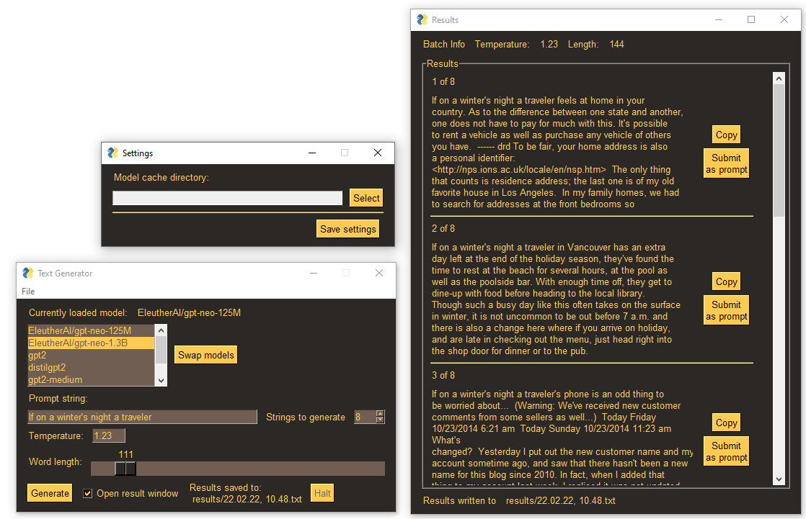

# If On A Winters Night a Traveler

## Casual NLG GUI app

> Every time I sit down here I read, "it was a dark and stormy night . . ." and the impersonality of the incipit seems to open the passage from one world to the other, from the time and space of here and now to the time and space of the written word; I feel the thrill of a beginning that can be followed by multiple developments, inexhaustibly...
> -Italo Calvino, *If on a Winter's Night a Traveler*



Easy to use GUI wrapper for running NLG models from HuggingFace locally.

Third party dependencies are PySimpleGUI and aitextgen

Provide a string of text as a prompt (or don't), modify the generator's parameters, and press "Generate."
Can generate up to 20 strings at a time of 750 word length without modification.
The more strings and the longer they are, the more time is required.

The models run on your CPU or CUDA compatible GPUs.
They can be quite large, so I deliberately restricted the list of available models, but you could easily expand it.
This app lets you choose where models are stored as well.

Please remember to use a virtual environment.

### Installation and Running
```
pip install -r requirements.txt
```
and
```
py main.py
```
#### What do I do if my CUDA capable GPU isn't working?
I think pip gets a CPU only version of PyTorch for aitextgen by default. 
Go to [this link](https://pytorch.org/get-started/locally) and follow the instructions on a clean virtual environment after already installing aitextgen, making sure to select CUDA 10.2/11.3 instead of CPU.
